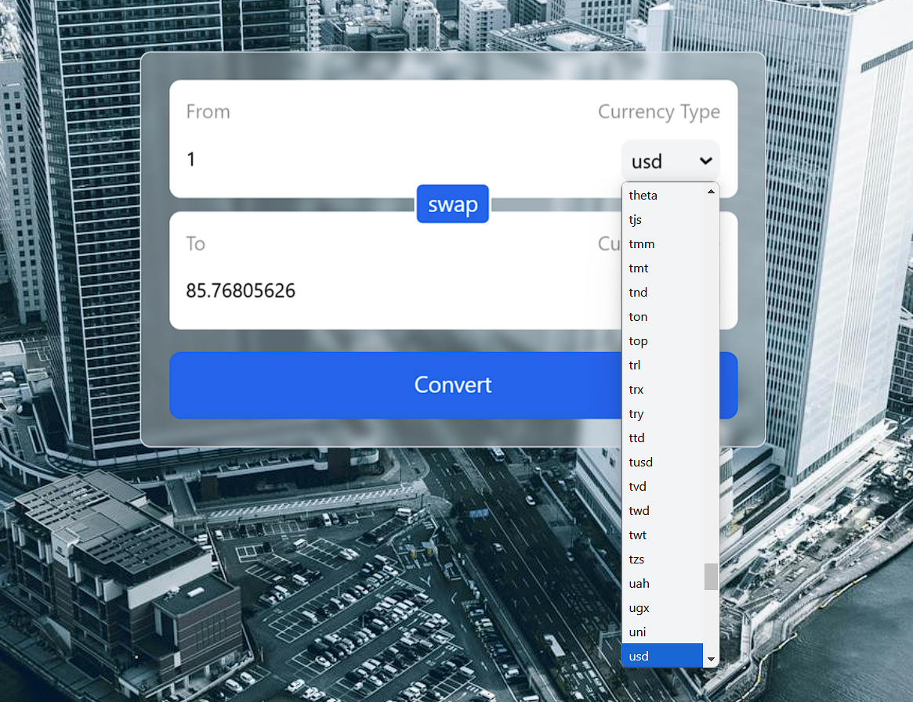

---

# Currency Converter 💱

A modern and responsive currency converter app built with **React**, **Vite**, and **Tailwind CSS**. This app allows users to easily convert currencies with live exchange rates.

## Features 🌟

- Fetches real-time exchange rates using the [Currency API](https://github.com/fawazahmed0/currency-api).
- Swap functionality to exchange "From" and "To" currencies instantly.
- Responsive design with a clean and intuitive interface.
- Built with modern tools like React and Tailwind CSS for fast and efficient development.

## Demo 📸




## Installation Steps 🛠️

1. Clone the repository:


2. Install dependencies:
   ```bash
   npm install
   ```

3. Start the development server:
   ```bash
   npm run dev
   ```

4. Open the app in your browser:
   ```
   http://localhost:5173
   ```

## How to Use 🎮

1. Enter the amount to convert in the **From** field.
2. Select the currencies for conversion (e.g., USD to INR).
3. Click the **Convert** button to see the converted amount.
4. Use the **Swap** button to switch between "From" and "To" currencies.

## Technology Stack 🛠️

- **React**: For building the user interface.
- **Vite**: For fast development and build tooling.
- **Tailwind CSS**: For styling the app.
- **JavaScript Fetch API**: For fetching live currency data.

## Code Highlights ✨

### Custom Hook for Fetching Currency Data:
```javascript
function useCurrencyInfo(currency) {
    const [data, setData] = useState({});
    useEffect(() => {
        fetch(`https://cdn.jsdelivr.net/npm/@fawazahmed0/currency-api@latest/v1/currencies/${currency}.json`)
            .then((res) => res.json())
            .then((res) => setData(res[currency]));
    }, [currency]);
    return data;
}
```

### Swap Functionality:
```javascript
const swap = () => {
    setFrom(to);
    setTo(from);
    setConvertedAmount(amount);
    setAmount(convertedAmount);
};
```


## Future Enhancements 🚀

- Add support for selecting the number of decimal places.
- Integrate historical exchange rates.
- Include light/dark mode toggle.
- Add unit tests for core functionality.

## Acknowledgments 🙏

- Live exchange rates provided by [Currency API](https://github.com/fawazahmed0/currency-api).
- Background image from [Pexels](https://pexels.com).

## License 🔒

This project is licensed under the MIT License.

---

I’m a beginner coder on a mission to create and learn. Your feedback means a lot!  
Contact me at: [derkaran@gmail.com](mailto:derkaran@gmail.com)  
Connect with me on LinkedIn: [](https://www.linkedin.com/in/karan-der/)

---
